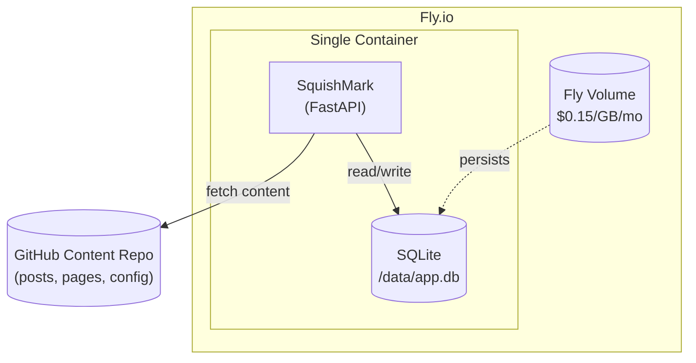
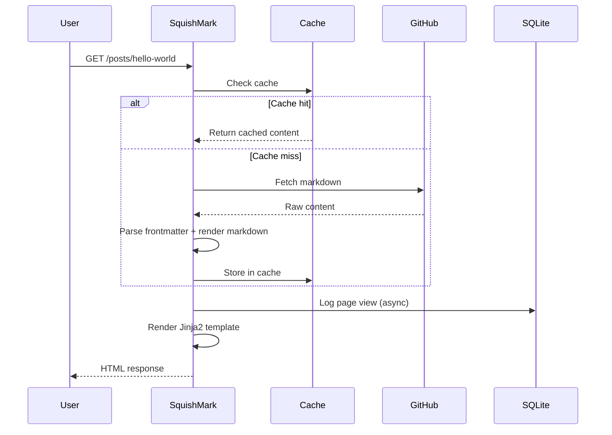
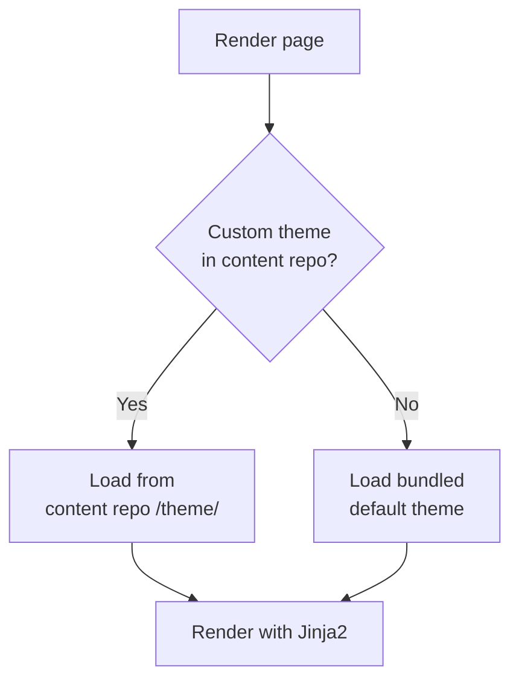
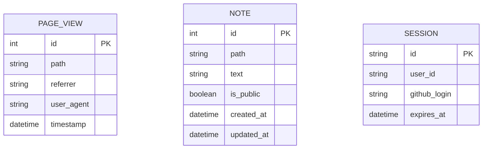

# CLAUDE.md - SquishMark Development Guide

This document provides context for AI assistants (and humans) working on the SquishMark codebase.

## Project Overview

SquishMark is a lightweight, GitHub-powered blogging engine. Content (posts, pages) lives in a separate GitHub repository and is fetched at runtime. Themes use Jinja2 templates, making them accessible to web developers without Python knowledge.

## Architecture



### Request Flow



## Tech Stack

| Component | Choice | Notes |
|-----------|--------|-------|
| Language | Python 3.11+ | Type hints throughout |
| Framework | FastAPI | Async, modern, auto-docs |
| Templating | Jinja2 | Familiar to Jekyll/Hugo users |
| Database | SQLite | On Fly Volume, no backup service |
| ORM | SQLAlchemy | With aiosqlite for async |
| Markdown | python-markdown + Pygments | Server-side syntax highlighting |
| HTTP Client | httpx | Async GitHub API calls |
| Auth | Authlib | GitHub OAuth for admin features |

## Repository Structure

```
squishmark/
├── src/
│   └── squishmark/
│       ├── __init__.py
│       ├── main.py              # FastAPI app entry
│       ├── config.py            # Pydantic settings
│       ├── routers/
│       │   ├── posts.py         # Blog post routes
│       │   ├── pages.py         # Static page routes
│       │   └── admin.py         # Notes, cache refresh, analytics
│       ├── services/
│       │   ├── github.py        # Content fetching from GitHub
│       │   ├── markdown.py      # Parsing + Pygments highlighting
│       │   └── cache.py         # In-memory content cache
│       ├── models/
│       │   ├── content.py       # Post, Page, FrontMatter
│       │   └── db.py            # SQLAlchemy models
│       └── themes/
│           └── engine.py        # Jinja2 theme loading/rendering
├── themes/
│   └── default/                 # Bundled default theme
│       ├── base.html
│       ├── index.html
│       ├── post.html
│       ├── page.html
│       └── static/
│           └── style.css
├── tests/
├── pyproject.toml
├── Dockerfile
├── fly.toml
├── CLAUDE.md
├── LICENSE
└── README.md
```

## Related Repositories

- **squishmark-starter**: Template repo for users to create their own content
- **xeek-dev-content**: Private content repo for xeek.dev (example implementation)

## Key Design Decisions

### Content from GitHub
- Posts and pages are fetched from a configurable GitHub repository
- Supports both public repos (no auth) and private repos (GitHub token)
- Content is cached in memory with configurable TTL
- Cache can be manually refreshed via admin endpoint or GitHub webhook

### Theming
- Themes are Jinja2 templates (`.html` files)
- Theme resolution order:
  1. Custom theme in content repo (`/theme/` directory)
  2. Bundled default theme
- Theme authors only need HTML/CSS/Jinja2 knowledge, no Python required



### Syntax Highlighting
- Pygments renders code blocks server-side
- HTML comes pre-highlighted, no client-side JavaScript needed
- Supports 500+ languages
- Theme CSS controls colors (monokai, dracula, github-dark, etc.)

### Database (SQLite on Fly Volume)
- Stores analytics (page views), admin notes, sessions
- NOT for content - content lives in GitHub
- Acceptable data loss risk since blog content is safe in GitHub
- Simple setup: just mount the Fly Volume at `/data`



### Admin Features
- GitHub OAuth login for admin access
- Notes/corrections: add public or private notes to any page
- Analytics: basic page view tracking
- Cache control: manual refresh endpoint

## Content Repository Structure

Users create a content repo with this structure:

```
my-content-repo/
├── posts/
│   ├── 2026-01-01-hello-world.md
│   └── 2026-01-15-another-post.md
├── pages/
│   └── about.md
├── theme/                    # Optional custom theme
│   └── ...
└── config.yml
```

### Frontmatter Format

```yaml
---
title: My Post Title
date: 2026-01-15
tags: [python, blogging]
draft: false
---

Post content in markdown...
```

## Configuration

### Environment Variables

```bash
# Required
GITHUB_CONTENT_REPO=xeek-dev/xeek-dev-content
GITHUB_TOKEN=ghp_...  # Only for private repos

# Optional
CACHE_TTL_SECONDS=300
DATABASE_URL=sqlite:///data/squishmark.db

# GitHub OAuth (for admin features)
GITHUB_CLIENT_ID=...
GITHUB_CLIENT_SECRET=...
```

### config.yml (in content repo)

```yaml
site:
  title: "My Blog"
  description: "A blog about things"
  author: "Your Name"
  url: "https://example.com"

theme:
  name: default
  pygments_style: monokai

posts:
  per_page: 10
```

## Development

### Local Setup

```bash
# Clone the repo
git clone https://github.com/xeek-dev/squishmark.git
cd squishmark

# Create virtual environment
python -m venv .venv
source .venv/bin/activate  # or .venv\Scripts\activate on Windows

# Install dependencies
pip install -e ".[dev]"

# Run locally
uvicorn squishmark.main:app --reload
```

### Running Tests

```bash
pytest
```

### Docker Build

```bash
docker build -t squishmark .
docker run -p 8000:8000 -e GITHUB_CONTENT_REPO=user/repo squishmark
```

## Deployment (Fly.io)

```bash
# First time
fly launch

# Create volume for SQLite
fly volumes create squishmark_data --size 1

# Set secrets
fly secrets set GITHUB_TOKEN=ghp_...
fly secrets set GITHUB_CLIENT_ID=...
fly secrets set GITHUB_CLIENT_SECRET=...

# Deploy
fly deploy
```

## Common Tasks

### Adding a new route
1. Create router in `src/squishmark/routers/`
2. Register in `main.py`
3. Add corresponding Jinja2 template if needed

### Adding a Pygments theme
1. Generate CSS: `pygmentize -S monokai -f html > themes/default/static/pygments.css`
2. Include in theme's base template

### Testing with a local content repo
Set `GITHUB_CONTENT_REPO` to a local path (prefixed with `file://`) for development without GitHub API calls.

## Code Style & Gotchas

### SQLAlchemy
- **Boolean comparisons**: Use `.is_(True)` and `.is_(False)` instead of `== True`.
  ```python
  query.where(Note.is_public.is_(True))  # Correct
  ```

### python-markdown
- **output_format**: Use `"html"` not `"html5"`.
- **TocExtension with permalinks**: Headings get `id` attributes and anchor links. Test for `<h1 id=` not just `<h1>`.

### Dockerfile
- Copy ALL files referenced in pyproject.toml before `pip install .` (README.md, LICENSE, etc.).

## Skills

Custom slash commands are available in `.claude/skills/`:

| Command | Description |
|---------|-------------|
| `/dev` | Start the development server with hot reload |
| `/test` | Run the test suite with pytest |
| `/lint` | Run ruff linting |
| `/format` | Format code with ruff |
| `/typecheck` | Run pyright type checking |
