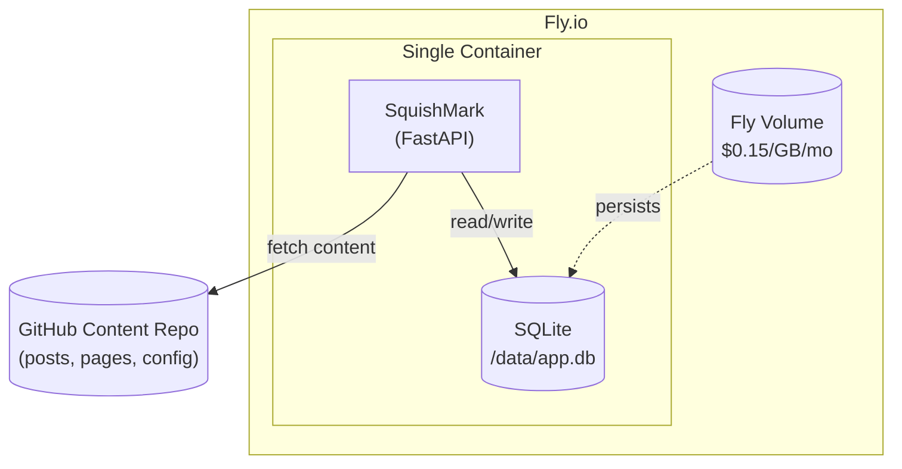
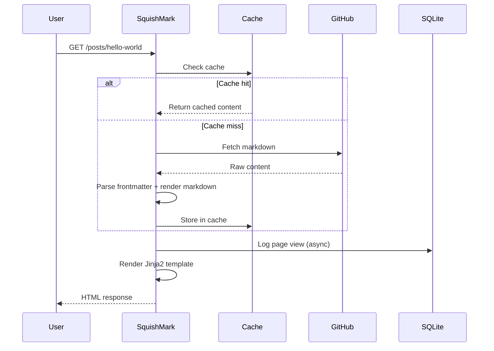
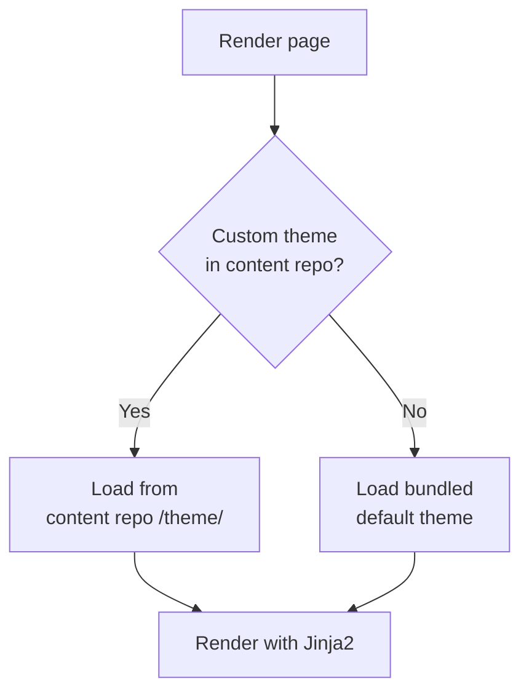
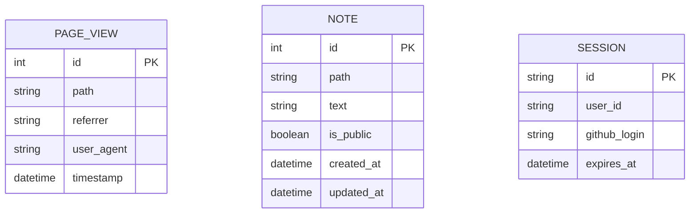

# CLAUDE.md - SquishMark Development Guide

This document provides context for AI assistants (and humans) working on the SquishMark codebase.

## Project Overview

SquishMark is a lightweight, GitHub-powered blogging engine. Content (posts, pages) lives in a separate GitHub repository and is fetched at runtime. Themes use Jinja2 templates, making them accessible to web developers without Python knowledge.

## Shell Conventions

- **Do not prefix every Bash command with `cd /path/to/repo &&`.** The working directory persists between Bash calls. Only change directory when you actually need to be somewhere different.
- Before your first shell command in a session, run `pwd` to confirm cwd if unsure — then just run commands directly.
- **Git commit messages:** Use multiple `-m` flags instead of `$()` heredoc substitution, which triggers a command-substitution security prompt. Example: `git commit -m "title" -m "body" -m "Co-Authored-By: ..."`

## Skills

**INSTRUCTION:** If your task involves Python, Docker, browser testing, GitHub operations, or theme creation, invoke the relevant skill using `Skill(skill-name)`.

| Skill | Description |
|-------|-------------|
| `python` | Python coding standards and gotchas (SQLAlchemy, python-markdown, async patterns) |
| `docker` | Dockerfile standards (hatchling builds, multi-stage patterns) |
| `playwright` | E2E browser testing with Playwright MCP (navigation, screenshots, hard refresh, cache busting) |
| `github` | GitHub operations via gh CLI (issues, PRs, labels, milestones, GraphQL) |
| `theme-creator` | Theme authoring — templates, variables, filters, static files |

## Planning Workflow

When planning implementation work, follow this workflow:

1. **Git Setup**
   - Switch to main branch and fetch/pull latest changes
   - Prompt about GitHub issue tracking:
     - "Should we use an existing GitHub issue, create a new one, or skip issue tracking?"
     - If existing: ask for issue number
     - If new: create issue with appropriate title/description
   - Prompt about branch creation:
     - "Should we create a new branch for this work?"
     - Use **Conventional Commits style prefixes** matching the anticipated merge commit
     - Format: `type/issue-description`
     - Examples:
       - `feat/42-user-authentication`
       - `fix/15-header-overflow`
       - `refactor/16-theme-subpackage`
       - `chore/23-update-dependencies`
       - `docs/8-api-documentation`

2. **Implementation**
   - Follow the approved plan
   - Run verification (tests, lint, format)
   - Manual testing: start dev server with `python scripts/start-dev.py` (or `-b` for background) and verify changes work

3. **PR Workflow**
   - Commit messages and PR titles **must** use [Conventional Commits](https://www.conventionalcommits.org/) format: `type(scope): description`
     - Examples: `feat(terminal): add pixel art title renderer`, `fix(docs): correct cache-busting instructions`
     - Use the same `type` as the branch prefix; `scope` is optional but recommended
   - Commit and push changes
   - Create PR linked to the issue
   - Wait for CI checks to pass
   - If checks fail: fix issues, commit, add brief PR comment about the fix, repeat

## GitHub Interaction

For all GitHub operations (issues, PRs, labels, milestones), use the `github` skill. If `gh` commands fail with auth errors, run `gh auth login`.

When commenting on PRs or issues, always sign with `*— Claude*`.

## Architecture



### Request Flow



## Tech Stack

| Component | Choice | Notes |
|-----------|--------|-------|
| Language | Python 3.14 | Type hints throughout |
| Framework | FastAPI | Async, modern, auto-docs |
| Templating | Jinja2 | Familiar to Jekyll/Hugo users |
| Database | SQLite | On Fly Volume, no backup service |
| ORM | SQLAlchemy | With aiosqlite for async |
| Markdown | python-markdown + Pygments | Server-side syntax highlighting |
| HTTP Client | httpx | Async GitHub API calls |
| Auth | Authlib | GitHub OAuth for admin features |

## Repository Structure

```
squishmark/
├── src/
│   └── squishmark/
│       ├── __init__.py
│       ├── main.py              # FastAPI app entry
│       ├── config.py            # Pydantic settings
│       ├── dependencies.py      # FastAPI dependency injection
│       ├── routers/
│       │   ├── posts.py         # Blog post routes
│       │   ├── pages.py         # Static page routes
│       │   ├── admin.py         # Notes, cache refresh, analytics
│       │   ├── auth.py          # GitHub OAuth authentication
│       │   └── webhooks.py      # GitHub webhook handling
│       ├── services/
│       │   ├── github.py        # Content fetching from GitHub
│       │   ├── markdown.py      # Parsing + Pygments highlighting
│       │   ├── cache.py         # In-memory content cache
│       │   ├── analytics.py     # Page view tracking
│       │   ├── notes.py         # Admin notes functionality
│       │   ├── url_rewriter.py  # URL rewriting for markdown
│       │   └── theme/           # Jinja2 theme engine (subpackage)
│       │       ├── __init__.py
│       │       ├── engine.py
│       │       ├── loader.py
│       │       ├── filters.py
│       │       └── favicon.py
│       └── models/
│           ├── content.py       # Post, Page, FrontMatter
│           └── db.py            # SQLAlchemy models
├── themes/
│   ├── default/                 # Bundled default theme
│   │   ├── base.html
│   │   ├── index.html
│   │   ├── post.html
│   │   ├── page.html
│   │   └── static/
│   │       └── style.css
│   ├── blue-tech/               # Dark SaaS aesthetic
│   └── terminal/                # Dark terminal with pixel art titles
├── tests/
├── pyproject.toml
├── Dockerfile
├── fly.toml
├── CLAUDE.md
├── LICENSE
└── README.md
```

## Related Repositories

- **squishmark-starter**: Template repo for users to create their own content
- **xeek-dev-content**: Private content repo for xeek.dev (example implementation)

## Key Design Decisions

### Content from GitHub
- Posts and pages are fetched from a configurable GitHub repository
- Supports both public repos (no auth) and private repos (GitHub token)
- Content is cached in memory with configurable TTL
- Cache can be manually refreshed via admin endpoint or GitHub webhook

### Theming
- Themes are Jinja2 templates (`.html` files)
- Theme resolution order:
  1. Custom theme in content repo (`/theme/` directory)
  2. Bundled default theme
- Theme authors only need HTML/CSS/Jinja2 knowledge, no Python required



### Syntax Highlighting
- Pygments renders code blocks server-side
- HTML comes pre-highlighted, no client-side JavaScript needed
- Supports 500+ languages
- Theme CSS controls colors (monokai, dracula, github-dark, etc.)

### Database (SQLite on Fly Volume)
- Stores analytics (page views), admin notes, sessions
- NOT for content - content lives in GitHub
- Acceptable data loss risk since blog content is safe in GitHub
- Simple setup: just mount the Fly Volume at `/data`



### Admin Features
- GitHub OAuth login for admin access
- Notes/corrections: add public or private notes to any page
- Analytics: basic page view tracking
- Cache control: manual refresh endpoint

## Content Repository Structure

Users create a content repo with this structure:

```
my-content-repo/
├── posts/
│   ├── 2026-01-01-hello-world.md
│   └── 2026-01-15-another-post.md
├── pages/
│   └── about.md
├── static/                   # User static files (favicon, images)
│   └── favicon.ico           # Auto-detected and served at /favicon.ico
├── theme/                    # Optional custom theme
│   └── ...
└── config.yml
```

### Frontmatter Format

```yaml
---
title: My Post Title
date: 2026-01-15
tags: [python, blogging]
draft: false
featured: true        # Optional: include in featured_posts template context
featured_order: 1     # Optional: sort order (lower = first, nulls last)
---

Post content in markdown...
```

## Configuration

### Environment Variables

```bash
# Required
GITHUB_CONTENT_REPO=xeek-dev/xeek-dev-content
GITHUB_TOKEN=ghp_...  # Only for private repos

# Optional
CACHE_TTL_SECONDS=300
DATABASE_URL=sqlite:///data/squishmark.db

# GitHub OAuth (for admin features)
GITHUB_CLIENT_ID=...
GITHUB_CLIENT_SECRET=...
```

### config.yml (in content repo)

```yaml
site:
  title: "My Blog"
  description: "A blog about things"
  author: "Your Name"
  url: "https://example.com"
  favicon: "/static/user/custom-icon.png"  # Optional: override auto-detected favicon
  featured_max: 5                           # Optional: max featured posts (default: 5)

theme:
  name: default
  pygments_style: monokai

posts:
  per_page: 10
```

## Development

### Local Setup

```bash
# Clone the repo
git clone https://github.com/xeek-dev/squishmark.git
cd squishmark

# Create virtual environment
python -m venv .venv
source .venv/bin/activate  # or .venv\Scripts\activate on Windows

# Install dependencies
pip install -e ".[dev]"

# Run locally
uvicorn squishmark.main:app --reload
```

### Development Scripts

Three scripts in `scripts/` streamline local development:

#### `start-dev.py` — Dev server with multi-server management

Starts a uvicorn dev server pointing at the local `content/` directory. Supports running multiple named server instances simultaneously (tracked in `.dev-servers.json`). The default instance name is the current git branch.

```bash
# Basic usage
python scripts/start-dev.py                     # foreground on :8000
python scripts/start-dev.py -b                  # background on :8000
python scripts/start-dev.py -b --port 8001      # background on :8001
python scripts/start-dev.py --name api -b       # named background instance

# Server management
python scripts/start-dev.py --list              # show all tracked servers
python scripts/start-dev.py --stop              # stop current branch's server
python scripts/start-dev.py --stop api          # stop named server
python scripts/start-dev.py --stop 12345        # stop server by PID
python scripts/start-dev.py --stop-all          # stop all servers
python scripts/start-dev.py --restart -b        # restart in background

# Other options
python scripts/start-dev.py --host 0.0.0.0     # bind to all interfaces
python scripts/start-dev.py --no-reload         # disable auto-reload
```

> **Stale port gotcha:** Background start (`-b`) can silently fail if a stale process holds the port. The old process keeps serving while the new one exits. Always verify after restart: `--stop <name>` then `lsof -ti:<port> | xargs kill` before starting fresh.

#### `run-checks.py` — Local CI checks

Runs the same checks as CI: **ruff format**, **ruff check**, **pytest**, and **pyright**. By default runs all checks and reports a summary.

```bash
python scripts/run-checks.py                    # run all checks
python scripts/run-checks.py --fail-fast        # stop on first failure
python scripts/run-checks.py --docker           # also run docker build (slow)
```

#### `setup-worktree.py` — Git worktree management

Creates isolated worktrees in `.worktrees/` for parallel development. Branch names follow the project's `type/issue-description` convention; the type prefix is stripped to form the directory name (e.g., `feat/42-dark-mode` becomes `.worktrees/42-dark-mode`).

```bash
python scripts/setup-worktree.py feat/42-dark-mode                # create worktree + branch
python scripts/setup-worktree.py feat/42-dark-mode --install      # also pip install -e
python scripts/setup-worktree.py feat/42-dark-mode --with-content # also copy content/
python scripts/setup-worktree.py feat/42-dark-mode --integration  # --install + --with-content
python scripts/setup-worktree.py --list                           # list active worktrees
python scripts/setup-worktree.py --cleanup 42-dark-mode           # remove worktree + branch
python scripts/setup-worktree.py --cleanup 42-dark-mode --force   # skip confirmation
```

#### `github-issue-updater.py` — Issue metadata updater

Sets issue type (task/bug/feature), adds labels, and assigns milestones in a single command. Issue types require GraphQL mutations which this script handles automatically.

```bash
python scripts/github-issue-updater.py 42 --type task
python scripts/github-issue-updater.py 42 --add-label "engine,themes"
python scripts/github-issue-updater.py 42 --milestone "SquishMark 1.0"
python scripts/github-issue-updater.py 42 --type task --add-label engine --milestone "SquishMark 1.0"
```

### Running Tests

```bash
pytest
```

### Docker Build

```bash
docker build -t squishmark .
docker run -p 8000:8000 -e GITHUB_CONTENT_REPO=user/repo squishmark
```

## Deployment (Fly.io)

```bash
# First time
fly launch

# Create volume for SQLite
fly volumes create squishmark_data --size 1

# Set secrets
fly secrets set GITHUB_TOKEN=ghp_...
fly secrets set GITHUB_CLIENT_ID=...
fly secrets set GITHUB_CLIENT_SECRET=...

# Deploy
fly deploy
```

## Common Tasks

### Adding a new route
1. Create router in `src/squishmark/routers/`
2. Register in `main.py`
3. Add corresponding Jinja2 template if needed

### Adding a Pygments theme
1. Generate CSS: `pygmentize -S monokai -f html > themes/default/static/pygments.css`
2. Include in theme's base template

### Testing with a local content repo
Set `GITHUB_CONTENT_REPO` to a local path (prefixed with `file://`) for development without GitHub API calls.
